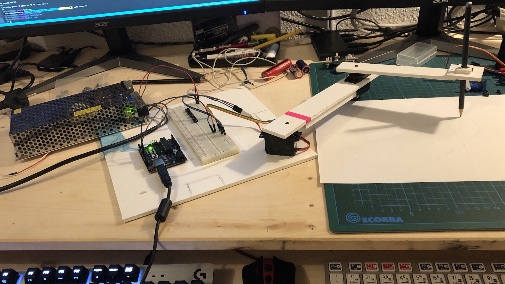

# CT DrawBot 

>Seminar "Creative Technologists - Tracing the City" @ [University of Applied Sciences Potsdam](https://github.com/FH-Potsdam/) (Germany) winter semester 2019/2020 by [Fabian Morón Zirfas](https://fabianmoronzirfas.me)

## Assignment

Bau mit einen Arduinbo, der über [Johnny-Five](http://johnny-five.io/) an gesteuert wird.

## Usage

1. Install Node.js (Prefer LTS!).
2. [Setup your board.](http://johnny-five.io/platform-support/)
3. Get Johnny-Five: npm install johnny-five *
4. Run your program! node index.js

## Überlegungen

### 1 Übergung

Meine erste Überlegung für einen Zeichen robotter ist der Klassische X/Y tisch wie bei einer CNC Destopfräse. Die schnällste wariante einen Null butget X/Y-Tisch zu bauen den ist meiner Meinung nach Zwei alte CD Laufwärke umzu funktionieren. Leider besitze weder ich noch leute in meinem bekanten Kreis zur Zeit alte CD/DVD Laufwärke.
Witer hin findet man Schritmotoren und eunfache Lineareinheiten in druckern. Auf die nach Frage in meiem freundes Kreises nach alten Druckern wurde mir ein Mimaki CG-121 angeboten.
Dies ist ein größer Viinyl Schneide Plotter. Bei genaueren nach fragen warum sie diesen Plotter abgeben wollen kommt heraus das es für diesen einfach keinen Aktuellen Treiber mehr gibt, er mechanisch und elektrisch noch voll funktion tüchtig ist.
Jetzt könnte ich nötürlich diesen voll funktions tüchtiegen Plotter schlacheten um ein eignen Plotter draus zu bauen oder einfach die ganze Konstuktion belassen wie sie ist und einfach die Steuer elektronik austauschen.

### 2 Überlegung

Wenn ich jetzt schon einen fast funktionierenden Schnitplotter habe kann ich natürlich die ver bauten schritmotoren mit einem Arduino wie [Johnny-Five](http://johnny-five.io/) ansteuern. Was aus meiner sicht wenig Sinn ergibt. Praktische vor dem hinter Grund dieses grät wieder seiner ursprünglichen funktion zu zufüren ist es den die Motoren über einen GCode Interper anzusteuern.
Und sich ein Workflow für die erzeucgung des GCodes zu überlegen.

## Rechersche

### Treiber für die schritmotoren

Nach einigen Lesen in einschlägigen Foren bin ich zum entschluss gekommen das Treiber der Firma
[TRINAMIC](https://www.trinamic.com/products/drives/) zu verwänden. Ganz Konkret habe ich erst mal den TMC2208 bestellt. Dieser ist recht Günstig müsste von den wewrten her funktioniren und ist wohl sehr leise.

### GCode Interper

GCode Interpteter gibt es viel von Komerzell mit spezeller Hardware bis zu Opensorse.
Da sich diese Projekt um ein No Budget projekt handetl und wir einen Artduino benutzen ahbe ich mich für [grbl](https://github.com/grbl/grbl) endschieden.

### GCode erzeugen
Gcode lässt sich aus Vertorgrafiklen erzeugen. Ein kostenloses Open Source Velktrografikprogeam ist [Inkscape](https://inkscape.org/) für das es anscheind auch erweiterungen gibt mit denen man Gcode genreieren kann.

### Übertraggung des Gcodes

Zum Schluss muss noch der generierte Gcode zu dem Plotter Übertragen werden. Da für gibt es ein liste von Tols auf der [grbl-Wiki](https://github.com/grbl/grbl/wiki/Using-Grbl) Seite

## Versuche

### Stepper mit Johnny ansteuern

Um zuschaune wie man einen Schritmotor ansteuern kann nehmen wir einen einfachne kleinen 28BYJ-48 und ein ULN2003 als treiber. Beide Bauteile eignen sich gut für erste versuche, da sie in vieln Arduino-Kit's enthalten, sie sind relativ Preisgünstig, beide Bautele konnen mit einter Spannung von 5V betriben werden.

Um mit [Johnny-Five](http://johnny-five.io/) einen Stepper zu betreitreiben muss auf den Arduino die [AdvancedFirmata](https://github.com/soundanalogous/AdvancedFirmata) gespeilt werden.

#### 28BYJ-48

- 5V
- 330 mA
- 4 Phasen
- Unipolar
- 32 steps
- Der Motor hat ein eingebautes getribe, damit ensprichen 64 steps nicht einer vollen umdreung der Gehäuisespindel.

#### Probleme

Die dre richtung des Steppes lässt sich nicht ändern. Mir ist bis jetzt unklar, ob es an Johnny 5, dem getriebe oder einem anderen fehler liegt.

## Author(s)

**Jendrik Bradaczek**

- [github/](https://github.com/dISCOeRG0sUM)

## License

Copyright © 2019 Jendrik Bradaczek
Licensed under the MIT license.
